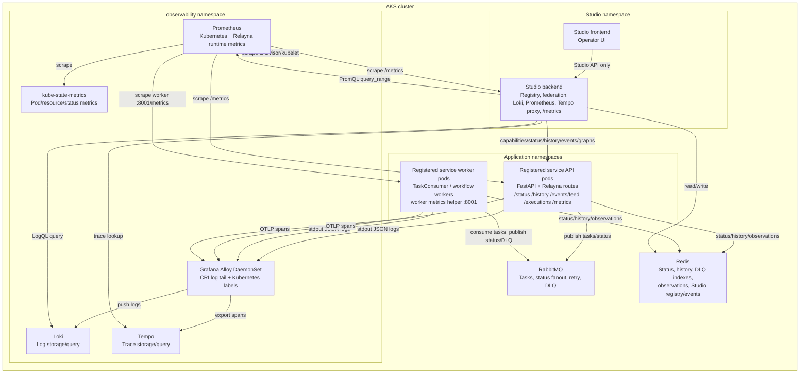

# AKS observability stack

Relayna can run without Studio, Loki, Alloy, Prometheus, or Tempo. A complete
Relayna Studio deployment on AKS needs those components when operators want
centralized logs, Kubernetes metrics, aggregate Relayna runtime metrics, exact
task resource samples, and trace correlation in one place.

## Required components

| Component | Required for | Notes |
| --- | --- | --- |
| Registered service API pods | Relayna capabilities, status/history, event feed, execution graph, optional `/metrics` | Include `create_metrics_router(runtime.metrics)` when the API should expose runtime metrics. |
| Registered service worker pods | Task execution, lifecycle observations, worker-only `/metrics` | Use `start_metrics_http_server(runtime.metrics, port=8001)` for worker-only processes. |
| Redis | Relayna status, DLQ indexes, observation history, Studio registry/events | API pods, worker pods, and Studio must share the same logical Redis data plane for complete task detail. |
| RabbitMQ | Relayna task queues, status fanout, retry/DLQ flows | Workers publish lifecycle status and observations around RabbitMQ task handling. |
| Loki | Studio log panels | Studio queries Loki from the backend. The browser does not connect to Loki directly. |
| Alloy | Kubernetes pod log collection, Loki forwarding, and optional OTLP trace receiving | Runs as a DaemonSet for logs. It can also run an OpenTelemetry collector pipeline that forwards spans to Tempo. |
| Prometheus | Studio Kubernetes metrics and Relayna runtime charts | Scrapes cAdvisor, kube-state-metrics, Relayna API `/metrics`, worker `/metrics`, and Studio backend `/metrics`. |
| kube-state-metrics | Pod phase, readiness, resource requests/limits, restart/OOM metrics | Prometheus needs this for the Phase 2 Kubernetes metric groups. |
| Tempo | Studio trace panels | Stores OpenTelemetry spans. Studio queries Tempo by `trace_id` through the backend. |
| Studio backend | Service registry, federation, log query proxy, metrics query proxy, trace query proxy, `/metrics` | Configure egress allowlists for AKS service DNS and observability services. |
| Studio frontend | Operator UI | Talks only to the Studio backend. |

Prometheus labels must stay low-cardinality. Do not use `task_id`,
`correlation_id`, `request_id`, `worker_id`, `pod`, `pod_name`, `container`, or
`message_id` as Relayna runtime metric labels. Exact per-task CPU/RSS samples
are Relayna observations stored with task lifecycle data, not Prometheus series.

## Architecture

The overall system looks like this when Relayna services, service workers,
Studio, Redis, RabbitMQ, Loki, Alloy, Prometheus, Tempo, and
kube-state-metrics run inside AKS:




## Feature layers

The same AKS stack supports all four Studio observability phases:

1. Centralized logs: pods write JSON logs to stdout, Alloy attaches Kubernetes
   metadata, and Loki stores the result for Studio log panels.
2. Kubernetes metrics: Prometheus scrapes cAdvisor and kube-state-metrics so
   Studio can show service and task-window infrastructure metrics. Studio uses
   `kube_pod_labels` to resolve registered service selector labels to owned
   pods, then joins platform metrics by namespace and pod.
3. Relayna runtime metrics and observations: API/worker `/metrics` endpoints
   expose aggregate counters/histograms while Redis observations preserve exact
   per-task CPU/RSS samples for execution graphs.
4. Trace correlation: Relayna propagates W3C `traceparent`/`tracestate` through
   RabbitMQ headers, the application-owned OpenTelemetry SDK exports spans to
   Alloy/Tempo, and Studio links task detail to trace spans.

## Relayna pod conventions

Use stable Kubernetes labels on all pods that belong to one logical Relayna
service:

```yaml
metadata:
  labels:
    service: checker-service
    app: checker-service-worker
  annotations:
    prometheus.io/scrape: "true"
    prometheus.io/port: "8001"
    prometheus.io/path: "/metrics"
```

Recommended label meaning:

- `service`: logical Relayna service registered in Studio.
- `app`: concrete emitter inside that service, such as `checker-service-api`,
  `checker-service-worker`, or `checker-service-workflow`.

For API pods that expose Relayna metrics through FastAPI:

```python
from fastapi import FastAPI

from relayna.api import create_metrics_router, create_relayna_lifespan, get_relayna_runtime

app = FastAPI(lifespan=create_relayna_lifespan(topology=topology, redis_url=redis_url))
runtime = get_relayna_runtime(app)
app.include_router(create_metrics_router(runtime.metrics))
```

For worker-only pods:

```python
from relayna.api import start_metrics_http_server

runtime = build_worker_runtime()
start_metrics_http_server(runtime.metrics, port=8001)
await runtime.run_forever()
```

If your runtime metrics use the SDK default service label value `relayna`, set
`metrics_config.runtime_service_label_value` in Studio. If you construct
`RelaynaMetrics(service="checker-service")`, that value can match the Studio
`service_id` instead.

## Loki and Alloy log setup

Alloy should collect container stdout, parse Kubernetes metadata, keep
low-cardinality labels, and push to Loki. Relayna task identifiers should remain
inside JSON log bodies unless you intentionally accept the Loki cardinality
cost.

Minimal Alloy River example:

```river
logging {
  level  = "info"
  format = "logfmt"
}

discovery.kubernetes "pods" {
  role = "pod"
}

discovery.relabel "pod_logs" {
  targets = discovery.kubernetes.pods.targets

  rule {
    source_labels = ["__meta_kubernetes_namespace"]
    target_label  = "namespace"
  }

  rule {
    source_labels = ["__meta_kubernetes_pod_label_service"]
    target_label  = "service"
  }

  rule {
    source_labels = ["__meta_kubernetes_pod_label_app"]
    target_label  = "app"
  }

  rule {
    source_labels = ["__meta_kubernetes_pod_container_name"]
    target_label  = "container"
  }

  rule {
    source_labels = ["__meta_kubernetes_pod_uid", "__meta_kubernetes_pod_container_name"]
    separator     = "/"
    target_label  = "__path__"
    replacement   = "/var/log/pods/*$1/*.log"
  }
}

loki.source.kubernetes "pods" {
  targets    = discovery.relabel.pod_logs.output
  forward_to = [loki.process.relayna.receiver]
}

loki.process "relayna" {
  stage.cri {}

  stage.json {
    expressions = {
      level          = "level",
      task_id        = "task_id",
      correlation_id = "correlation_id",
    }
  }

  stage.labels {
    values = {
      level = "level",
    }
  }

  forward_to = [loki.write.default.receiver]
}

loki.write "default" {
  endpoint {
    url = "http://loki.observability.svc.cluster.local:3100/loki/api/v1/push"
  }
}
```

Keep these as normal Loki labels:

- `namespace`
- `service`
- `app`
- `container`
- `level`

Keep these in the JSON log body by default:

- `task_id`
- `correlation_id`
- `request_id`
- `worker_id`
- message payload snippets

## Prometheus setup

Prometheus needs four scrape paths for full Studio metrics:

1. cAdvisor/kubelet metrics for CPU, memory, and network counters.
2. kube-state-metrics for requests, limits, restarts, OOMKilled, pod phase, and
   readiness.
3. Relayna API and worker `/metrics` endpoints for aggregate runtime metrics.
4. Studio backend `/metrics` for Studio’s own runtime metrics.

Minimal Prometheus scrape config:

```yaml
global:
  scrape_interval: 15s

scrape_configs:
  - job_name: kube-state-metrics
    static_configs:
      - targets:
          - kube-state-metrics.observability.svc.cluster.local:8080

  - job_name: kubernetes-cadvisor
    kubernetes_sd_configs:
      - role: node
    scheme: https
    tls_config:
      insecure_skip_verify: true
    bearer_token_file: /var/run/secrets/kubernetes.io/serviceaccount/token
    relabel_configs:
      - target_label: __address__
        replacement: kubernetes.default.svc:443
      - source_labels: [__meta_kubernetes_node_name]
        target_label: __metrics_path__
        replacement: /api/v1/nodes/${1}/proxy/metrics/cadvisor

  - job_name: relayna-pods
    kubernetes_sd_configs:
      - role: pod
    relabel_configs:
      - source_labels: [__meta_kubernetes_pod_annotation_prometheus_io_scrape]
        action: keep
        regex: "true"
      - source_labels: [__meta_kubernetes_pod_annotation_prometheus_io_path]
        target_label: __metrics_path__
        regex: (.+)
      - source_labels: [__address__, __meta_kubernetes_pod_annotation_prometheus_io_port]
        target_label: __address__
        regex: ([^:]+)(?::\d+)?;(\d+)
        replacement: ${1}:${2}
      - source_labels: [__meta_kubernetes_namespace]
        target_label: namespace
      - source_labels: [__meta_kubernetes_pod_name]
        target_label: pod
      - source_labels: [__meta_kubernetes_pod_container_name]
        target_label: container
      - source_labels: [__meta_kubernetes_pod_label_service]
        target_label: service
      - source_labels: [__meta_kubernetes_pod_label_app]
        target_label: app
```

## Tempo trace setup

Relayna core only depends on `opentelemetry-api`; each registered service that
wants real spans must add and configure its own OpenTelemetry SDK/exporter.
Relayna will propagate W3C trace context through RabbitMQ headers and create
safe spans around publish/consume/status/retry/DLQ paths when a tracer provider
is installed.

One practical AKS pattern is to send OTLP spans to Alloy and let Alloy export to
Tempo:

```river
otelcol.receiver.otlp "relayna" {
  grpc {
    endpoint = "0.0.0.0:4317"
  }

  http {
    endpoint = "0.0.0.0:4318"
  }

  output {
    traces = [otelcol.processor.batch.relayna.input]
  }
}

otelcol.processor.batch "relayna" {
  output {
    traces = [otelcol.exporter.otlp.tempo.input]
  }
}

otelcol.exporter.otlp "tempo" {
  client {
    endpoint = "tempo.observability.svc.cluster.local:4317"
    tls {
      insecure = true
    }
  }
}
```

For local development, sending spans directly to Tempo also works if Tempo's
OTLP ports are exposed:

```bash
OTEL_EXPORTER_OTLP_ENDPOINT=http://localhost:4317
OTEL_SERVICE_NAME=orders-api
```

## Studio service registration

Register each Relayna service with `log_config`, `metrics_config`, and
`trace_config` when all observability phases are enabled:

```json
{
  "service_id": "checker-service",
  "name": "Checker Service",
  "base_url": "http://checker-service-api.default.svc.cluster.local:8000",
  "environment": "prod-aks",
  "tags": ["checker", "aks"],
  "auth_mode": "internal_network",
  "log_config": {
    "provider": "loki",
    "base_url": "http://loki.observability.svc.cluster.local:3100",
    "tenant_id": null,
    "service_selector_labels": {
      "service": "checker-service"
    },
    "source_label": "app",
    "task_match_mode": "contains",
    "task_match_template": "{task_id}",
    "task_id_label": null,
    "correlation_id_label": "correlation_id",
    "level_label": "level"
  },
  "metrics_config": {
    "provider": "prometheus",
    "base_url": "http://prometheus.observability.svc.cluster.local:9090",
    "namespace": "default",
    "service_selector_labels": {
      "service": "checker-service"
    },
    "runtime_service_label_value": "relayna",
    "namespace_label": "namespace",
    "pod_label": "pod",
    "container_label": "container",
    "step_seconds": 30,
    "task_window_padding_seconds": 120
  },
  "trace_config": {
    "provider": "tempo",
    "base_url": "http://tempo.observability.svc.cluster.local:3200",
    "public_base_url": null,
    "tenant_id": null,
    "query_path": "/api/traces/{trace_id}"
  }
}
```

Configure Studio backend egress for AKS DNS:

```bash
RELAYNA_STUDIO_CAPABILITY_REFRESH_ALLOWED_HOSTS=.svc.cluster.local
```

If you use literal private IPs for Loki, Prometheus, Tempo, Redis, or
registered services, also set the matching CIDRs in
`RELAYNA_STUDIO_CAPABILITY_REFRESH_ALLOWED_NETWORKS`.

## Complete registered service example

The example below shows a single `orders-api` registered service with API pods,
worker pods, JSON logs for Loki, `/metrics` for Prometheus, Redis observations
for exact task resource samples, and OpenTelemetry spans for Tempo.

Install application-owned tracing dependencies in the service image:

```toml
[project]
dependencies = [
  "relayna>=1.4.10",
  "opentelemetry-sdk>=1.28.0",
  "opentelemetry-exporter-otlp-proto-grpc>=1.28.0",
  "structlog>=24.0.0",
]
```

Configure structured logs and tracing once at process startup:

```python
import logging
import structlog
from opentelemetry import trace
from opentelemetry.exporter.otlp.proto.grpc.trace_exporter import OTLPSpanExporter
from opentelemetry.sdk.resources import Resource
from opentelemetry.sdk.trace import TracerProvider
from opentelemetry.sdk.trace.export import BatchSpanProcessor

from relayna.observability import bind_studio_log_context


def configure_observability(*, service: str, app: str, env: str) -> structlog.BoundLogger:
    logging.basicConfig(format="%(message)s", level=logging.INFO)
    structlog.configure(
        processors=[
            structlog.processors.TimeStamper(fmt="iso", key="timestamp"),
            structlog.processors.add_log_level,
            structlog.processors.JSONRenderer(),
        ],
        wrapper_class=structlog.make_filtering_bound_logger(logging.INFO),
    )

    provider = TracerProvider(
        resource=Resource.create(
            {
                "service.name": app,
                "relayna.service_id": service,
                "deployment.environment": env,
            }
        )
    )
    provider.add_span_processor(
        BatchSpanProcessor(
            OTLPSpanExporter(endpoint="http://alloy.observability.svc.cluster.local:4317", insecure=True)
        )
    )
    trace.set_tracer_provider(provider)

    return bind_studio_log_context(
        structlog.get_logger(),
        service=service,
        app=app,
        env=env,
        runtime=app,
    )
```

Expose Relayna federation routes, metrics, status history, events, execution
graphs, and observations from the API process:

```python
from fastapi import FastAPI

from relayna.api import (
    create_capabilities_router,
    create_events_router,
    create_execution_router,
    create_metrics_router,
    create_relayna_lifespan,
    create_status_router,
    get_relayna_runtime,
)

app = FastAPI(
    lifespan=create_relayna_lifespan(
        topology=topology,
        redis_url="redis://redis.default.svc.cluster.local:6379/0",
        observation_store_prefix="orders:observations",
        service_event_store_prefix="orders:events",
        metrics_service_name="orders-api",
    )
)
runtime = get_relayna_runtime(app)
logger = configure_observability(service="orders-api", app="orders-api", env="prod-aks")

app.include_router(create_capabilities_router(topology=topology))
app.include_router(create_metrics_router(runtime.metrics))
app.include_router(
    create_status_router(
        sse_stream=runtime.sse_stream,
        history_reader=runtime.history_reader,
        latest_status_store=runtime.store,
    )
)
app.include_router(create_events_router(service_event_store=runtime.service_event_store))
app.include_router(create_execution_router(execution_graph_service=runtime.execution_graph_service))
```

Wire the worker to the same Redis observation store, expose worker metrics, and
emit task-aware JSON logs. Relayna handles trace propagation across RabbitMQ
headers; the worker only needs the OpenTelemetry SDK configured at startup.

```python
from redis.asyncio import Redis

from relayna.api import RelaynaMetrics, start_metrics_http_server
from relayna.consumer import RetryPolicy, TaskConsumer
from relayna.observability import RedisObservationStore, make_redis_observation_sink

redis = Redis.from_url("redis://redis.default.svc.cluster.local:6379/0")
observation_store = RedisObservationStore(redis, prefix="orders:observations")
logger = configure_observability(service="orders-api", app="orders-worker", env="prod-aks")
metrics = RelaynaMetrics(service="orders-api")


async def handle_order(message: dict) -> None:
    logger.info(
        "order_handler_started",
        task_id=message["task_id"],
        correlation_id=message.get("correlation_id"),
        stage="worker",
    )
    ...


consumer = TaskConsumer(
    rabbitmq=rabbitmq_client,
    handler=handle_order,
    retry_policy=RetryPolicy(max_retries=3, delay_ms=30_000),
    observation_sink=make_redis_observation_sink(observation_store),
    metrics=metrics,
)

start_metrics_http_server(metrics, port=8001)
await consumer.run_forever()
```

Use low-cardinality pod labels and Prometheus scrape annotations on both API and
worker workloads:

```yaml
metadata:
  labels:
    service: orders-api
    app: orders-worker
  annotations:
    prometheus.io/scrape: "true"
    prometheus.io/port: "8001"
    prometheus.io/path: "/metrics"
```

Register the service in Studio with all three provider configs:

```bash
curl -X POST http://studio-backend.studio.svc.cluster.local:8000/studio/services \
  -H 'Content-Type: application/json' \
  -d '{
    "service_id": "orders-api",
    "name": "Orders API",
    "base_url": "http://orders-api.default.svc.cluster.local:8000",
    "environment": "prod-aks",
    "tags": ["orders", "aks"],
    "auth_mode": "internal_network",
    "log_config": {
      "provider": "loki",
      "base_url": "http://loki.observability.svc.cluster.local:3100",
      "service_selector_labels": {"service": "orders-api"},
      "source_label": "app",
      "task_match_mode": "contains",
      "task_match_template": "{task_id}",
      "correlation_id_label": null,
      "level_label": "level"
    },
    "metrics_config": {
      "provider": "prometheus",
      "base_url": "http://prometheus.observability.svc.cluster.local:9090",
      "namespace": "default",
      "service_selector_labels": {"service": "orders-api"},
      "runtime_service_label_value": "orders-api",
      "namespace_label": "namespace",
      "pod_label": "pod",
      "container_label": "container",
      "step_seconds": 30,
      "task_window_padding_seconds": 120
    },
    "trace_config": {
      "provider": "tempo",
      "base_url": "http://tempo.observability.svc.cluster.local:3200",
      "public_base_url": null,
      "tenant_id": null,
      "query_path": "/api/traces/{trace_id}"
    }
  }'
```

After a task runs, Studio should be able to show:

- service logs and task logs from Loki
- service and task-window metrics from Prometheus
- Relayna runtime charts and exact task CPU/RSS samples
- execution graph and task timeline from Redis-backed Relayna status and
  observation data
- trace IDs discovered from task detail/log fields and Tempo spans in the task
  detail Trace Correlation section

## Bootstrap script

The repository includes a starter AKS deployment script:

```bash
scripts/deploy-relayna-observability-aks.sh
```

It installs a namespace, Loki, Alloy, Prometheus, Tempo, and
kube-state-metrics with Relayna-compatible scrape, log-label, and OTLP trace
forwarding defaults for all four phases. Review storage classes, resource
requests, retention, auth, and network policy before using it in production.

Useful overrides:

```bash
NAMESPACE=observability
STORAGE_CLASS=managed-csi
LOKI_STORAGE_SIZE=10Gi
PROMETHEUS_STORAGE_SIZE=20Gi
TEMPO_STORAGE_SIZE=10Gi
LOKI_RETENTION=168h
PROMETHEUS_RETENTION=15d
TEMPO_RETENTION=168h
TEMPO_IMAGE=grafana/tempo:latest
```
