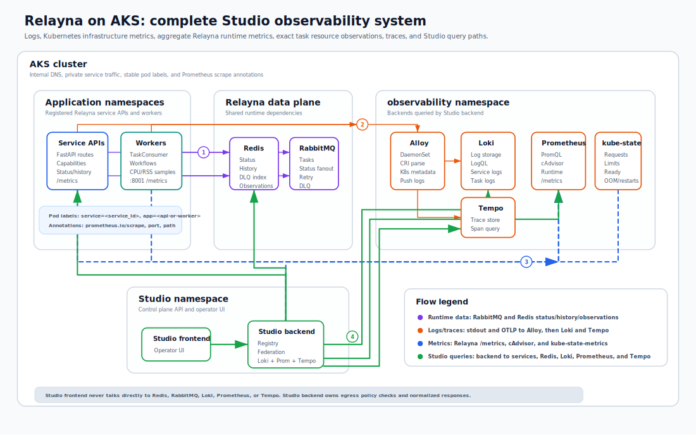
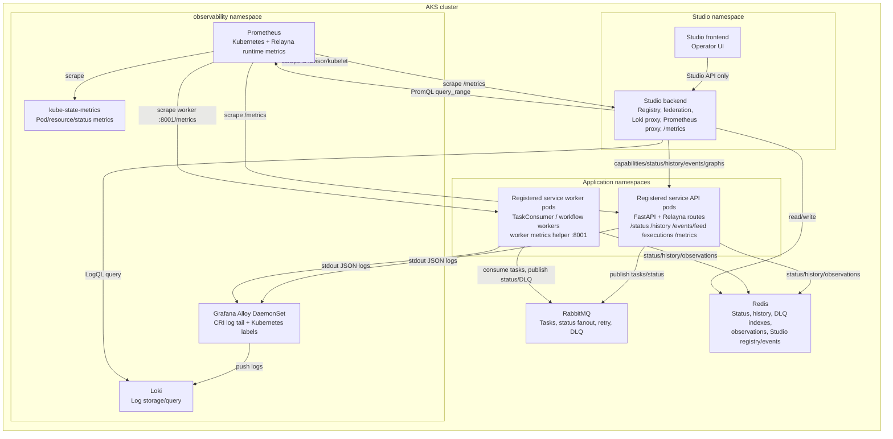

# AKS observability stack

Relayna can run without Studio, Loki, Alloy, or Prometheus. A complete Relayna
Studio deployment on AKS needs those components when operators want centralized
logs, Kubernetes metrics, aggregate Relayna runtime metrics, and exact task
resource samples in one place.

## Required components

| Component | Required for | Notes |
| --- | --- | --- |
| Registered service API pods | Relayna capabilities, status/history, event feed, execution graph, optional `/metrics` | Include `create_metrics_router(runtime.metrics)` when the API should expose runtime metrics. |
| Registered service worker pods | Task execution, lifecycle observations, worker-only `/metrics` | Use `start_metrics_http_server(runtime.metrics, port=8001)` for worker-only processes. |
| Redis | Relayna status, DLQ indexes, observation history, Studio registry/events | API pods, worker pods, and Studio must share the same logical Redis data plane for complete task detail. |
| RabbitMQ | Relayna task queues, status fanout, retry/DLQ flows | Workers publish lifecycle status and observations around RabbitMQ task handling. |
| Loki | Studio log panels | Studio queries Loki from the backend. The browser does not connect to Loki directly. |
| Alloy | Kubernetes pod log collection and Loki forwarding | Runs as a DaemonSet and reads `/var/log/pods` or `/var/log/containers`. |
| Prometheus | Studio Kubernetes metrics and Relayna runtime charts | Scrapes cAdvisor, kube-state-metrics, Relayna API `/metrics`, worker `/metrics`, and Studio backend `/metrics`. |
| kube-state-metrics | Pod phase, readiness, resource requests/limits, restart/OOM metrics | Prometheus needs this for the Phase 2 Kubernetes metric groups. |
| Studio backend | Service registry, federation, log query proxy, metrics query proxy, `/metrics` | Configure egress allowlists for AKS service DNS and observability services. |
| Studio frontend | Operator UI | Talks only to the Studio backend. |

Prometheus labels must stay low-cardinality. Do not use `task_id`,
`correlation_id`, `request_id`, `worker_id`, `pod`, `pod_name`, `container`, or
`message_id` as Relayna runtime metric labels. Exact per-task CPU/RSS samples
are Relayna observations stored with task lifecycle data, not Prometheus series.

## Architecture

The overall system looks like this when Relayna services, service workers,
Studio, Redis, RabbitMQ, Loki, Alloy, Prometheus, and kube-state-metrics run
inside AKS:





## Relayna pod conventions

Use stable Kubernetes labels on all pods that belong to one logical Relayna
service:

```yaml
metadata:
  labels:
    service: checker-service
    app: checker-service-worker
  annotations:
    prometheus.io/scrape: "true"
    prometheus.io/port: "8001"
    prometheus.io/path: "/metrics"
```

Recommended label meaning:

- `service`: logical Relayna service registered in Studio.
- `app`: concrete emitter inside that service, such as `checker-service-api`,
  `checker-service-worker`, or `checker-service-workflow`.

For API pods that expose Relayna metrics through FastAPI:

```python
from fastapi import FastAPI

from relayna.api import create_metrics_router, create_relayna_lifespan, get_relayna_runtime

app = FastAPI(lifespan=create_relayna_lifespan(topology=topology, redis_url=redis_url))
runtime = get_relayna_runtime(app)
app.include_router(create_metrics_router(runtime.metrics))
```

For worker-only pods:

```python
from relayna.api import start_metrics_http_server

runtime = build_worker_runtime()
start_metrics_http_server(runtime.metrics, port=8001)
await runtime.run_forever()
```

If your runtime metrics use the SDK default service label value `relayna`, set
`metrics_config.runtime_service_label_value` in Studio. If you construct
`RelaynaMetrics(service="checker-service")`, that value can match the Studio
`service_id` instead.

## Loki and Alloy setup

Alloy should collect container stdout, parse Kubernetes metadata, keep
low-cardinality labels, and push to Loki. Relayna task identifiers should remain
inside JSON log bodies unless you intentionally accept the Loki cardinality
cost.

Minimal Alloy River example:

```river
logging {
  level  = "info"
  format = "logfmt"
}

discovery.kubernetes "pods" {
  role = "pod"
}

discovery.relabel "pod_logs" {
  targets = discovery.kubernetes.pods.targets

  rule {
    source_labels = ["__meta_kubernetes_namespace"]
    target_label  = "namespace"
  }

  rule {
    source_labels = ["__meta_kubernetes_pod_label_service"]
    target_label  = "service"
  }

  rule {
    source_labels = ["__meta_kubernetes_pod_label_app"]
    target_label  = "app"
  }

  rule {
    source_labels = ["__meta_kubernetes_pod_container_name"]
    target_label  = "container"
  }

  rule {
    source_labels = ["__meta_kubernetes_pod_uid", "__meta_kubernetes_pod_container_name"]
    separator     = "/"
    target_label  = "__path__"
    replacement   = "/var/log/pods/*$1/*.log"
  }
}

loki.source.kubernetes "pods" {
  targets    = discovery.relabel.pod_logs.output
  forward_to = [loki.process.relayna.receiver]
}

loki.process "relayna" {
  stage.cri {}

  stage.json {
    expressions = {
      level          = "level",
      task_id        = "task_id",
      correlation_id = "correlation_id",
    }
  }

  stage.labels {
    values = {
      level = "level",
    }
  }

  forward_to = [loki.write.default.receiver]
}

loki.write "default" {
  endpoint {
    url = "http://loki.observability.svc.cluster.local:3100/loki/api/v1/push"
  }
}
```

Keep these as normal Loki labels:

- `namespace`
- `service`
- `app`
- `container`
- `level`

Keep these in the JSON log body by default:

- `task_id`
- `correlation_id`
- `request_id`
- `worker_id`
- message payload snippets

## Prometheus setup

Prometheus needs four scrape paths for full Studio metrics:

1. cAdvisor/kubelet metrics for CPU, memory, and network counters.
2. kube-state-metrics for requests, limits, restarts, OOMKilled, pod phase, and
   readiness.
3. Relayna API and worker `/metrics` endpoints for aggregate runtime metrics.
4. Studio backend `/metrics` for Studio’s own runtime metrics.

Minimal Prometheus scrape config:

```yaml
global:
  scrape_interval: 15s

scrape_configs:
  - job_name: kube-state-metrics
    static_configs:
      - targets:
          - kube-state-metrics.observability.svc.cluster.local:8080

  - job_name: kubernetes-cadvisor
    kubernetes_sd_configs:
      - role: node
    scheme: https
    tls_config:
      insecure_skip_verify: true
    bearer_token_file: /var/run/secrets/kubernetes.io/serviceaccount/token
    relabel_configs:
      - target_label: __address__
        replacement: kubernetes.default.svc:443
      - source_labels: [__meta_kubernetes_node_name]
        target_label: __metrics_path__
        replacement: /api/v1/nodes/${1}/proxy/metrics/cadvisor

  - job_name: relayna-pods
    kubernetes_sd_configs:
      - role: pod
    relabel_configs:
      - source_labels: [__meta_kubernetes_pod_annotation_prometheus_io_scrape]
        action: keep
        regex: "true"
      - source_labels: [__meta_kubernetes_pod_annotation_prometheus_io_path]
        target_label: __metrics_path__
        regex: (.+)
      - source_labels: [__address__, __meta_kubernetes_pod_annotation_prometheus_io_port]
        target_label: __address__
        regex: ([^:]+)(?::\d+)?;(\d+)
        replacement: ${1}:${2}
      - source_labels: [__meta_kubernetes_namespace]
        target_label: namespace
      - source_labels: [__meta_kubernetes_pod_name]
        target_label: pod
      - source_labels: [__meta_kubernetes_pod_container_name]
        target_label: container
      - source_labels: [__meta_kubernetes_pod_label_service]
        target_label: service
      - source_labels: [__meta_kubernetes_pod_label_app]
        target_label: app
```

## Studio service registration

Register each Relayna service with both `log_config` and `metrics_config`:

```json
{
  "service_id": "checker-service",
  "name": "Checker Service",
  "base_url": "http://checker-service-api.default.svc.cluster.local:8000",
  "environment": "prod-aks",
  "tags": ["checker", "aks"],
  "auth_mode": "internal_network",
  "log_config": {
    "provider": "loki",
    "base_url": "http://loki.observability.svc.cluster.local:3100",
    "tenant_id": null,
    "service_selector_labels": {
      "service": "checker-service"
    },
    "source_label": "app",
    "task_match_mode": "contains",
    "task_match_template": "{task_id}",
    "task_id_label": null,
    "correlation_id_label": "correlation_id",
    "level_label": "level"
  },
  "metrics_config": {
    "provider": "prometheus",
    "base_url": "http://prometheus.observability.svc.cluster.local:9090",
    "namespace": "default",
    "service_selector_labels": {
      "service": "checker-service"
    },
    "runtime_service_label_value": "relayna",
    "namespace_label": "namespace",
    "pod_label": "pod",
    "container_label": "container",
    "step_seconds": 30,
    "task_window_padding_seconds": 120
  }
}
```

Configure Studio backend egress for AKS DNS:

```bash
RELAYNA_STUDIO_CAPABILITY_REFRESH_ALLOWED_HOSTS=.svc.cluster.local
```

If you use literal private IPs for Loki, Prometheus, Redis, or registered
services, also set the matching CIDRs in
`RELAYNA_STUDIO_CAPABILITY_REFRESH_ALLOWED_NETWORKS`.

## Bootstrap script

The repository includes a starter AKS deployment script:

```bash
scripts/deploy-relayna-observability-aks.sh
```

It installs a namespace, Loki, Alloy, Prometheus, and kube-state-metrics with
Relayna-compatible scrape and log-label defaults. Review storage classes,
resource requests, retention, auth, and network policy before using it in
production.
