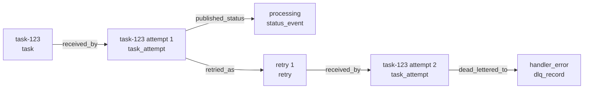
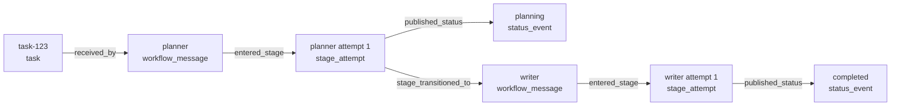

# Execution Graphs

Relayna's execution graph feature reconstructs what actually happened for a
task at runtime. It is a read model built from durable state that already
exists across Relayna's runtime packages:

- Redis status history from `RedisStatusStore`
- persisted task-linked observations from `RedisObservationStore`
- DLQ records from `DLQService` and `RedisDLQStore`
- parent-child aggregation lineage indexed from status `meta.parent_task_id`

This is intentionally different from the static workflow topology graph:

- topology graph answers "what stages can connect"
- status history answers "what happened in order"
- execution graph answers "what caused what"

## Public surfaces

Relayna exposes the execution-graph feature through:

- `relayna.observability.ExecutionGraph`
- `relayna.observability.ExecutionGraphNode`
- `relayna.observability.ExecutionGraphEdge`
- `relayna.observability.ExecutionGraphSummary`
- `relayna.observability.ExecutionGraphService`
- `relayna.observability.build_execution_graph(...)`
- `relayna.observability.execution_graph_mermaid(...)`
- `relayna.api.create_execution_router(...)`
- `relayna.studio.build_execution_view(...)`

## FastAPI route

Register the route from the FastAPI runtime:

```python
from fastapi import FastAPI
from redis.asyncio import Redis

from relayna.api import create_execution_router, create_relayna_lifespan, get_relayna_runtime
from relayna.consumer import RetryPolicy, TaskConsumer
from relayna.observability import RedisObservationStore, make_redis_observation_sink

observation_store_prefix = "relayna-observations"

worker_observation_store = RedisObservationStore(
    Redis.from_url("redis://localhost:6379/0"),
    prefix=observation_store_prefix,
    ttl_seconds=86400,
    history_maxlen=500,
)

consumer = TaskConsumer(
    rabbitmq=client,
    handler=handle_task,
    retry_policy=RetryPolicy(max_retries=3, delay_ms=30000),
    observation_sink=make_redis_observation_sink(worker_observation_store),
)

app = FastAPI(
    lifespan=create_relayna_lifespan(
        topology=topology,
        redis_url="redis://localhost:6379/0",
        observation_store_prefix=observation_store_prefix,
        observation_store_ttl_seconds=86400,
        observation_history_maxlen=500,
    )
)

runtime = get_relayna_runtime(app)
app.include_router(create_execution_router(execution_graph_service=runtime.execution_graph_service))
```

The default route is:

- `GET /executions/{task_id}/graph`

If you use `ContractAliasConfig`, the path parameter name follows
`http_aliases["task_id"]` and the JSON body field follows
`field_aliases["task_id"]`.

Route behavior:

- returns `404` only when Relayna has no status history, no persisted
  observations, and no DLQ records for the requested task
- returns a graph even without persisted observations when status or DLQ data
  exists
- sets `summary.graph_completeness` to `"full"` when observations were
  available
- sets `summary.graph_completeness` to `"partial"` when the graph had to be
  reconstructed from status and DLQ data only

## Runtime wiring

Execution graphs are most useful when both HTTP and workers share the same
Redis-backed observation store.

FastAPI runtime configuration on `create_relayna_lifespan(...)`:

- `observation_store_prefix`
- `observation_store_ttl_seconds`
- `observation_history_maxlen`

The runtime then exposes:

- `runtime.observation_store`
- `runtime.execution_graph_service`

Worker-side persistence uses:

- `RedisObservationStore`
- `make_redis_observation_sink(...)`

Important operational rule:

- use the same Redis instance and the same observation-store prefix in FastAPI
  and every worker process that should contribute to the graph

If workers do not persist observations, the route still works, but it can only
reconstruct a partial graph.

## Data model

Every topology returns the same outer response shape:

```json
{
  "task_id": "task-123",
  "topology_kind": "shared_tasks_shared_status",
  "summary": {
    "status": "failed",
    "started_at": "2026-04-06T10:00:00+00:00",
    "ended_at": "2026-04-06T10:00:03+00:00",
    "duration_ms": 3000,
    "graph_completeness": "full"
  },
  "nodes": [],
  "edges": [],
  "annotations": {},
  "related_task_ids": []
}
```

Summary fields:

- `status`: latest root-task status when one exists
- `started_at`: earliest timestamp seen across graph nodes and edges
- `ended_at`: latest root-task status timestamp when present, otherwise the
  latest graph timestamp
- `duration_ms`: `ended_at - started_at` in milliseconds when both exist
- `graph_completeness`: `"full"` or `"partial"`

## Node kinds

Relayna currently emits these standard node kinds:

- `task`
  The requested root task.
- `task_attempt`
  One queue-consumption attempt for a task or aggregation child.
- `workflow_message`
  A workflow transport message identified by `message_id`.
- `stage_attempt`
  One stage execution attempt in a workflow topology.
- `status_event`
  A persisted status history event.
- `retry`
  A scheduled retry edge point between attempts.
- `dlq_record`
  A dead-letter result from observation history or persisted DLQ detail.
- `aggregation_child`
  A child task linked back to the requested parent task.

Each node carries:

- `id`
- `kind`
- `task_id`
- `label`
- `timestamp`
- `annotations`

Common annotations include:

- `queue_name`
- `source_queue_name`
- `consumer_name`
- `correlation_id`
- `retry_attempt`
- `task_type`
- `stage`
- `message_id`
- `origin_stage`
- `reason`
- `max_retries`
- `meta`

## Edge kinds

Relayna currently emits these standard edge kinds:

- `received_by`
  Root task to task attempt, retry to next attempt, or root task to workflow
  message when no origin stage exists yet.
- `published_status`
  Attempt or stage attempt to status event.
- `retried_as`
  Attempt to retry node.
- `dead_lettered_to`
  Attempt to DLQ node.
- `manual_retry_to`
  Attempt to later attempt when a `manual_retrying` status indicates handoff.
- `entered_stage`
  Workflow message to stage attempt.
- `stage_transitioned_to`
  Stage attempt to downstream workflow message.
- `aggregated_into`
  Child task to parent task.

Each edge carries:

- `source`
- `target`
- `kind`
- `timestamp`
- `annotations`

## Topology-specific behavior

### Shared tasks

For `SharedTasksSharedStatusTopology`, the execution graph is a task-attempt
graph. Relayna does not invent workflow semantics for the shared-task topology,
even though the topology shim has a compatibility `"default"` stage view in
other places.

Typical shape:



### Routed tasks

For `RoutedTasksSharedStatusTopology`, the graph is still attempt-oriented, but
attempt nodes carry routed `task_type` metadata in their annotations. Manual
handoff through `TaskContext.manual_retry(...)` is represented with
`manual_retry_to` edges when the status history includes the `manual_retrying`
transition.

### Sharded aggregation

For sharded aggregation topologies, Relayna starts with the requested task id
and then asks `RedisStatusStore` for child task ids indexed from status
`meta.parent_task_id`.

That adds:

- `aggregation_child` nodes for child tasks
- `aggregated_into` edges from child task to parent task
- child attempts, retries, DLQ nodes, and statuses for every discovered child

This lets one graph show both the parent task timeline and the work delegated
to shard-owned child tasks.

### Workflow

For `SharedStatusWorkflowTopology`, the graph becomes stage-aware:

- `workflow_message` nodes come from `WorkflowMessagePublished` and
  `WorkflowMessageReceived`
- `stage_attempt` nodes come from `WorkflowMessageReceived`
- `stage_transitioned_to` edges connect a stage attempt to its downstream
  published workflow message
- `entered_stage` edges connect a workflow message to the stage attempt that
  consumed it
- status events attach to the most recent stage attempt at or before the status
  timestamp

Typical shape:



## Event sources used by the graph

Execution-graph reconstruction is a projection over existing durable artifacts.

Shared-task and routed-task graphs primarily use:

- `TaskMessageReceived`
- `TaskLifecycleStatusPublished`
- `ConsumerRetryScheduled`
- `ConsumerDeadLetterPublished`
- status history from `RedisStatusStore`
- optional persisted DLQ records from `DLQService`

Sharded aggregation graphs add:

- `AggregationMessageReceived`
- `AggregationMessageAcked`
- `AggregationHandlerFailed`
- `AggregationRetryScheduled`
- `AggregationDeadLetterPublished`
- child task discovery via `RedisStatusStore.get_child_task_ids(...)`

Workflow graphs primarily use:

- `WorkflowMessageReceived`
- `WorkflowMessagePublished`
- `WorkflowStageAcked`
- `WorkflowStageFailed`
- shared status history for user-visible status events

## Minimal vs full graphs

When observations are missing, Relayna still returns a useful graph:

- root `task` node
- one `status_event` node per stored status entry
- DLQ nodes when persisted DLQ detail exists

That fallback graph is marked:

- `summary.graph_completeness = "partial"`

When observation history exists, Relayna can reconstruct attempts, stage hops,
retry edges, and richer annotations:

- `summary.graph_completeness = "full"`

## Response example

Example shared-task response:

```json
{
  "task_id": "task-123",
  "topology_kind": "shared_tasks_shared_status",
  "summary": {
    "status": "failed",
    "started_at": "2026-04-06T10:00:00+00:00",
    "ended_at": "2026-04-06T10:00:03+00:00",
    "duration_ms": 3000,
    "graph_completeness": "full"
  },
  "nodes": [
    {
      "id": "task:task-123",
      "kind": "task",
      "task_id": "task-123",
      "label": "task-123",
      "timestamp": null,
      "annotations": {}
    },
    {
      "id": "task-attempt:task-123:1",
      "kind": "task_attempt",
      "task_id": "task-123",
      "label": "task-123 attempt 1",
      "timestamp": "2026-04-06T10:00:00+00:00",
      "annotations": {
        "queue_name": "tasks.queue",
        "retry_attempt": 0
      }
    }
  ],
  "edges": [
    {
      "source": "task:task-123",
      "target": "task-attempt:task-123:1",
      "kind": "received_by",
      "timestamp": "2026-04-06T10:00:00+00:00",
      "annotations": {}
    }
  ],
  "annotations": {},
  "related_task_ids": []
}
```

## Mermaid export

Use `execution_graph_mermaid(...)` to get a Mermaid flowchart string from any
`ExecutionGraph` instance:

```python
from relayna.observability import execution_graph_mermaid

mermaid = execution_graph_mermaid(graph)
print(mermaid)
```

This is intended for:

- docs
- debugging
- support tickets
- copying a graph into Markdown or internal runbooks

The exporter emits a left-to-right Mermaid `flowchart LR` and labels every node
with its user-visible label, node kind, and timestamp when present.

## Studio and React Flow

Relayna also exposes a Studio presenter helper:

```python
from relayna.studio import build_execution_view

payload = build_execution_view(graph)
```

The Studio execution view contains:

- `task_id`
- `topology_kind`
- `summary`
- `related_task_ids`
- `graph`
- `mermaid`

The bundled Studio frontend in `apps/studio/` uses the graph payload for
React Flow rendering and the Mermaid string for docs/debug display. That means
the same backend graph can drive:

- operator-facing interactive graph exploration in the app
- copy-paste Mermaid diagrams in documentation or incident notes

## Practical guidance

- Persist observations in every worker that should contribute to graph
  fidelity.
- Keep the FastAPI runtime and workers on the same observation-store prefix.
- Treat `graph_completeness="partial"` as a signal that observation wiring is
  missing or retention has already expired.
- Use the execution graph as a runtime diagnostic view. Keep using the static
  workflow topology graph when you need to describe the intended workflow
  design.
