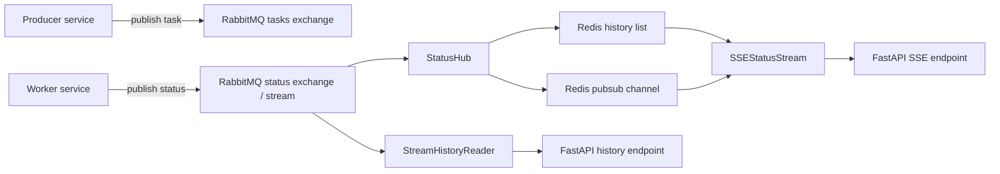

# relayna docs

`relayna` is shared infrastructure for services that need RabbitMQ task
delivery, Redis-backed status storage, and FastAPI endpoints for live status
streaming.

## What the library does

- publishes canonical task and status envelopes over RabbitMQ
- bridges shared status traffic into Redis history and pubsub
- replays stored history before switching clients to live SSE updates
- exposes small FastAPI helpers for lifecycle wiring and status routes
- supports RabbitMQ stream replay for bounded operational history reads

## Requirements

- Python `>=3.13`
- RabbitMQ
- Redis

## Install and release model

`relayna` v1 is distributed through GitHub Releases, not a package index.

- Release artifacts: [github.com/sarattha/relayna/releases](https://github.com/sarattha/relayna/releases)
- Hosted docs: [sarattha.github.io/relayna](https://sarattha.github.io/relayna/)

## Architecture

## Public API stability

The semver-stable v1 API is the documented surface of:

- `relayna.config`
- `relayna.contracts`
- `relayna.rabbitmq`
- `relayna.consumer`
- `relayna.status_store`
- `relayna.status_hub`
- `relayna.sse`
- `relayna.history`
- `relayna.fastapi`
- `relayna.observability`

The package root stays minimal and only exports `relayna.__version__`.

## Guides

- [Getting started](getting-started.md)
- [Components](components.md)
- [Release installation](releases.md)
- [Development](development.md)
