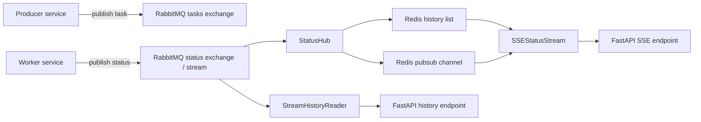

# relayna docs

`relayna` is shared infrastructure for services that need RabbitMQ task
delivery, Redis-backed status storage, and FastAPI endpoints for live status
streaming.

## What the library does

- publishes canonical task and status envelopes over RabbitMQ
- bridges shared status traffic into Redis history and pubsub
- replays stored history before switching clients to live SSE updates
- exposes small FastAPI helpers for lifecycle wiring and status routes
- supports payload and HTTP aliases for `task_id`-style fields
- supports batch-envelope task publishing with per-item worker context
- supports RabbitMQ stream replay for bounded operational history reads
- supports named RabbitMQ topologies for shared queues and shard-aware
  aggregation workers
- supports task execution graph reconstruction, Mermaid export, and Studio
  graph rendering for task, aggregation, and workflow runs

## Requirements

- Python `>=3.13`
- RabbitMQ
- Redis

## Install and release model

`relayna` v1 is distributed through GitHub Releases, not a package index.

- Release artifacts: [github.com/sarattha/relayna/releases](https://github.com/sarattha/relayna/releases)
- Hosted docs: [sarattha.github.io/relayna](https://sarattha.github.io/relayna/)

## Architecture

## Public API

The documented v2 package roots are:

- `relayna.topology`
- `relayna.contracts`
- `relayna.workflow`
- `relayna.rabbitmq`
- `relayna.consumer`
- `relayna.status`
- `relayna.observability`
- `relayna.api`
- `relayna.mcp`
- `relayna.dlq`

The package root stays minimal and only exports `relayna.__version__`.

## Package map

Use the v2 package roots by responsibility:

- `relayna.topology` defines RabbitMQ topology shapes, routing strategies, and
  workflow graph helpers.
- `relayna.contracts` defines canonical wire envelopes and alias/compatibility
  helpers.
- `relayna.rabbitmq` implements RabbitMQ client lifecycle, declarations,
  publishing, and retry infrastructure.
- `relayna.consumer` implements worker runtimes, handler contexts, lifecycle
  control, middleware, and idempotency hooks.
- `relayna.status` owns Redis-backed latest/history state, the `StatusHub`, SSE,
  and bounded stream replay.
- `relayna.api` owns FastAPI lifespan/runtime wiring and route factories built
  on top of `relayna.status`, `relayna.rabbitmq`, and `relayna.dlq`.
- `relayna.workflow` owns workflow control-plane helpers such as policies,
  transitions, fan-in, lineage, replay, and diagnostics.
- `relayna.dlq` owns DLQ persistence, queue summaries, and replay orchestration.
- `relayna.observability` owns typed runtime observations plus collector and
  exporter helpers.
- `relayna.mcp` adapts Relayna runtime state into MCP resources and tools.

`relayna.storage` is an internal support package. It backs the public runtime
packages but is not itself a documented public API root.

Studio deployment is packaged separately as `relayna-studio`.

## Guides

- [Migration v1 to v2](migration-v1-to-v2.md)
- [Getting started](getting-started.md)
- [Observability](observability.md)
- [AKS observability stack](aks-observability.md)
- [Execution graphs](execution-graphs.md)
- [Components](components.md)
- [Release installation](releases.md)
- [Development](development.md)
