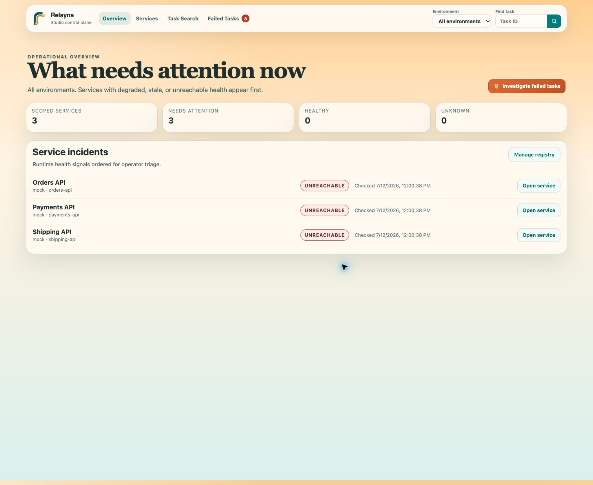
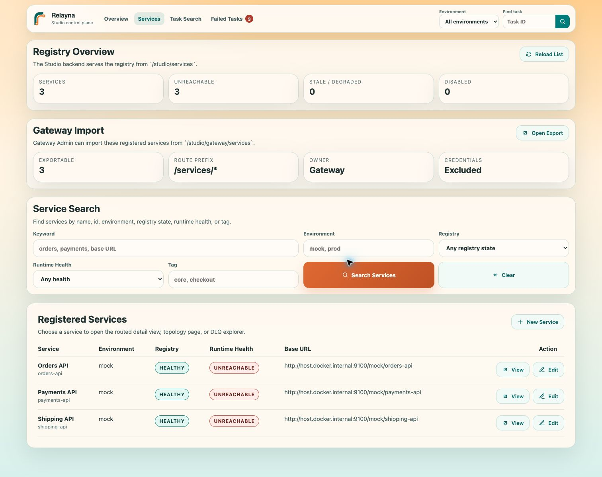
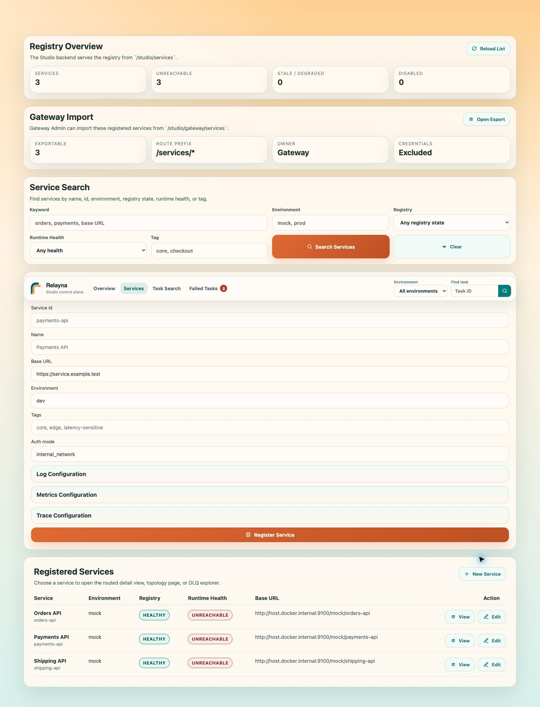
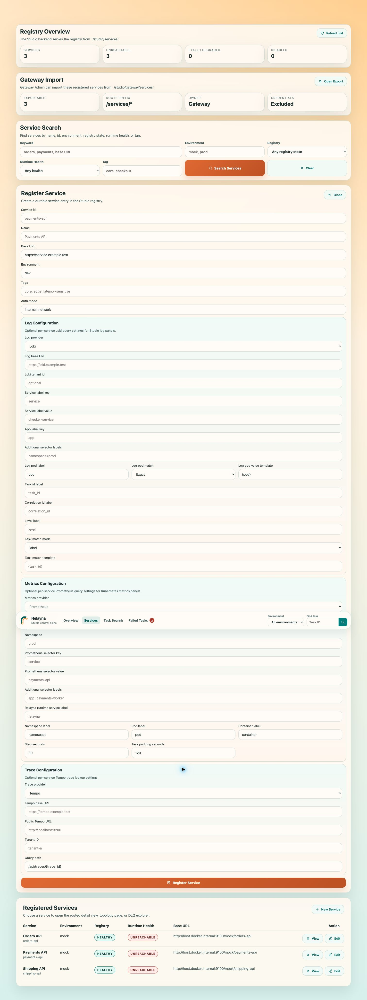
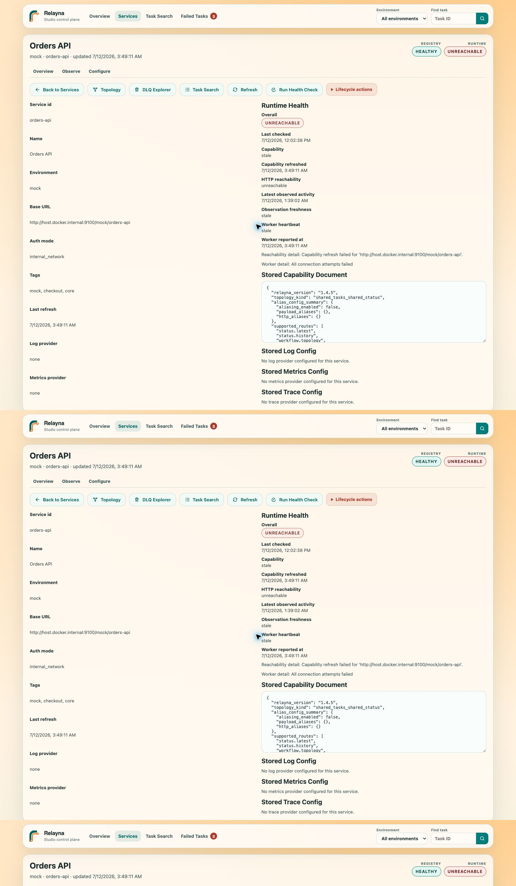
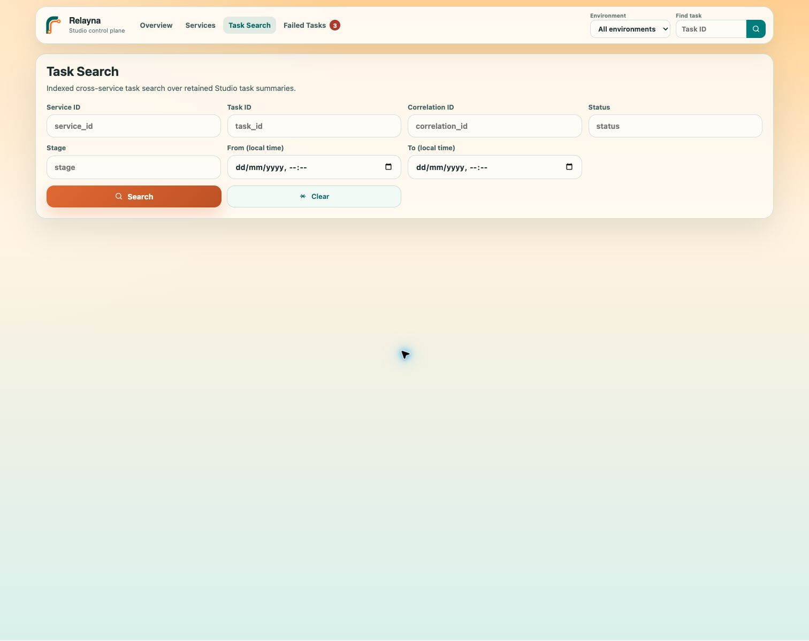
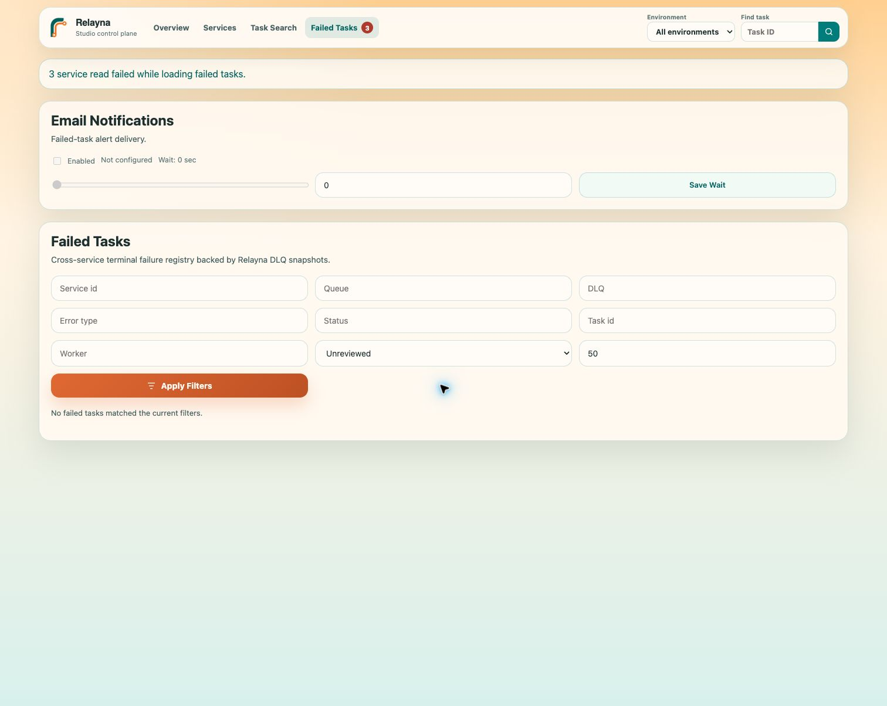
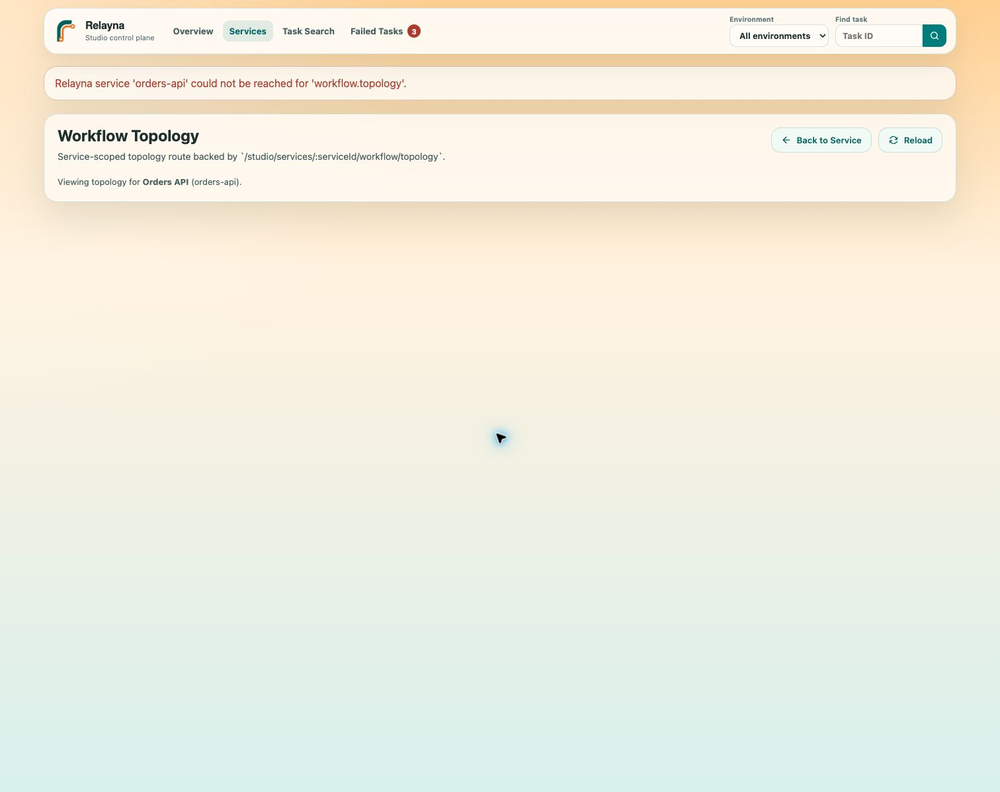
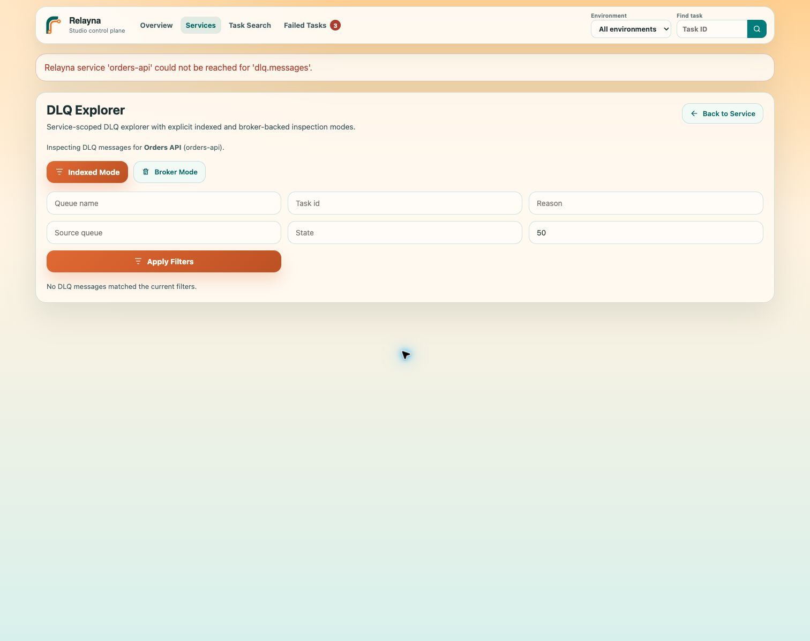

# Studio Frontend

This guide covers the Studio single-page application under `apps/studio/` and
how it is wired to the Studio backend in development and production.

If you need to operate the backend or understand `/studio/*` endpoints first,
see [Studio Backend](studio-backend.md).

## Role In The Architecture

The frontend is a React SPA. It does not talk directly to registered Relayna
services.

Its contract is:

- browser talks to the frontend origin
- frontend fetches `/studio/*`
- backend federates calls to registered Relayna services

That boundary keeps service discovery, normalization, and error handling in the
backend instead of in the browser.

## Studio Operator Tour

The screenshots in this guide come from the production Nginx frontend and
Studio backend running with Redis, RabbitMQ, and mock Relayna services. Values
such as `mock`, `orders-api`, and `host.docker.internal` are examples; use the
addresses and environment names that are reachable from your Studio backend.



The header is available on every page:

| Control | What it does |
| --- | --- |
| Relayna mark and name | Returns to the operational overview. |
| **Overview** | Opens incident-oriented service health and failed-task summaries. |
| **Services** | Opens registry status, service search, registration, and editing. |
| **Task Search** | Opens indexed cross-service task search. |
| **Failed Tasks** | Opens terminal failures; the badge is the current alert count. |
| **Environment** | Scopes service and task views. `All environments` removes the scope. |
| **Find task** | Accepts a task ID and sends it to Task Search in the selected environment. |
| Magnifying-glass button | Runs the global task-ID search. |

## Register A Service Step By Step

Before you start, confirm these facts:

1. The service exposes the Relayna capability and operational routes expected
   by the SDK version in use.
2. The **Studio backend**, not only your browser, can resolve and connect to the
   service base URL.
3. `RELAYNA_STUDIO_CAPABILITY_REFRESH_ALLOWED_HOSTS` or
   `RELAYNA_STUDIO_CAPABILITY_REFRESH_ALLOWED_NETWORKS` permits the target.
4. Any Loki, Prometheus, or Tempo URL is also reachable and allowed from the
   backend network.

### Step 1: Open the registry

Choose **Services**. Review **Registry Overview** and the registered-services
table before creating a duplicate. Use **Service Search** when the registry is
large.



Registry and runtime health are deliberately separate:

- **Registry** describes the Studio record: `healthy`, `registered`,
  `unavailable`, or `disabled`.
- **Runtime Health** summarizes reachability, capabilities, observations, and
  worker heartbeat freshness: `healthy`, `degraded`, `stale`, `unreachable`,
  `disabled`, or `unknown`.

### Step 2: Start a new draft

Choose **New Service**. Studio opens a registration form without changing the
registry. **Close** abandons the visible draft; **Register Service** is the only
action that creates the record.



Enter the core fields:

| Field | Required | Guidance |
| --- | --- | --- |
| **Service id** | Yes | Stable, URL-safe identity such as `payments-api`. It cannot be changed after registration. |
| **Name** | Yes | Operator-facing label such as `Payments API`. |
| **Base URL** | Yes | `http` or `https` origin reachable from Studio backend. Do not include credentials, query strings, or fragments. |
| **Environment** | Yes | Stable scope such as `dev`, `staging`, or `prod`. |
| **Tags** | No | Comma-separated search labels such as `core, checkout`. |
| **Auth mode** | Yes | Descriptive access mode. The common internal deployment value is `internal_network`. |

For Docker Desktop, a service running on the host commonly uses a base URL such
as `http://host.docker.internal:9100`. In Kubernetes, prefer a namespace-aware
service DNS name such as `http://payments-api.payments.svc.cluster.local:8000`.

### Step 3: Configure logs, metrics, and traces

The three configuration groups are optional and default to **Disabled**. Open a
group and select its provider only when Studio should query that system for the
service. Provider credentials remain a deployment/backend concern and should
not be placed in these URL fields.



#### Loki log configuration

| Field | Purpose |
| --- | --- |
| **Log provider** | `Disabled` or `Loki`. |
| **Log base URL** | Backend-reachable Loki origin. |
| **Loki tenant id** | Optional `X-Scope-OrgID` value. |
| **Service label key/value** | Primary stream selector, for example `service=payments-api`. |
| **App label key** | Label used to identify the application/workload. |
| **Additional selector labels** | Comma-separated `key=value` restrictions such as `namespace=prod`. |
| **Log pod label** | Loki label containing the pod or Alloy instance identity. |
| **Log pod match** | `Exact` for a literal pod value or `Regex` for rendered templates. |
| **Log pod value template** | Usually `{pod}`; an Alloy example is `{namespace}/{pod}:.*`. |
| **Task id / correlation id / level label** | Structured labels used when present. |
| **Task match mode** | `label`, `contains`, `regex`, or `structured_metadata`. |
| **Task match template** | Template rendered with `{task_id}` for contains/regex matching. |

#### Prometheus metrics configuration

| Field | Purpose |
| --- | --- |
| **Metrics provider** | `Disabled` or `Prometheus`. |
| **Prometheus base URL** | Backend-reachable Prometheus origin. |
| **Namespace** | Kubernetes namespace used in service and task metric queries. |
| **Prometheus selector key/value** | Main workload selector. |
| **Additional selector labels** | Extra comma-separated `key=value` restrictions. |
| **Relayna runtime service label** | Service value used by aggregate Relayna runtime charts. |
| **Namespace / pod / container label** | Prometheus label names used for Kubernetes series. |
| **Step seconds** | Query resolution. Lower values increase returned samples and backend load. |
| **Task padding seconds** | Time added before and after a task window for task charts. |

#### Tempo trace configuration

| Field | Purpose |
| --- | --- |
| **Trace provider** | `Disabled` or `Tempo`. |
| **Tempo base URL** | Backend-reachable Tempo origin. |
| **Public Tempo URL** | Optional operator-browser URL used for outbound links. |
| **Tenant ID** | Optional Tempo tenant header value. |
| **Query path** | Trace lookup template, normally `/api/traces/{trace_id}`. |

### Step 4: Register and verify

Choose **Register Service**. After the record appears:

1. Confirm its environment, status, runtime health, and base URL in the table.
2. Choose **View** to open the service detail page.
3. Choose **Run Health Check**, then **Refresh**, and inspect any reachability or
   capability errors.
4. Open **Topology**, **DLQ Explorer**, activity, logs, metrics, and pods as
   applicable to the service.
5. If Gateway Admin consumes Studio records, use **Open Export** to inspect the
   generated `/studio/gateway/services` catalog.

Do not mark a service `healthy` based only on the registry chip. Runtime health
must also show the expected reachability and freshness for the deployment.

## Complete UI Control Reference

This section explains the visible buttons, filters, status actions, and page
configuration controls. Disabled buttons indicate that the capability or
required selection is unavailable.

### Overview

| Control | Effect |
| --- | --- |
| **Investigate failed tasks** | Opens the global failed-task registry. |
| **Manage registry** | Opens Services. |
| **Open service** | Opens the selected incident's service detail. |

### Services and registration

| Control | Effect |
| --- | --- |
| **Reload List** | Reloads registry records and their latest summarized health. |
| **Open Export** | Opens the Gateway import JSON catalog. It does not import or mutate Gateway. |
| **Keyword / Environment / Registry / Runtime Health / Tag** | Narrow service search by the corresponding indexed fields. |
| **Search Services** | Runs the service search. |
| **Clear** | Restores all service-search defaults. |
| **New Service** | Opens a blank registration draft. |
| **View** | Opens service detail. |
| **Edit** | Opens the service editor populated from the selected record. |
| **New Draft** | Leaves edit mode and starts a blank record. |
| **Close** | Closes the editor without submitting. |
| **Register Service** | Creates the record. |
| **Save Service** | Updates mutable fields on an existing record. |
| **Open Detail Page** | Opens detail for the record currently being edited. |
| **Delete Service** | Opens typed confirmation and permanently removes the registry record. It does not delete the deployed service. |

### Service detail



| Control | Effect |
| --- | --- |
| **Back to Services** | Returns to registry search/list. |
| **Topology** | Opens the service workflow topology. |
| **DLQ Explorer** | Opens indexed or broker-backed DLQ inspection. |
| **Task Search** | Opens Task Search pre-scoped to the service. |
| **Refresh** | Refreshes the registered service's capabilities/metadata. |
| **Run Health Check** | Requests an immediate Studio health evaluation. |
| **Enable** | Sets registry status to `registered`. |
| **Mark Unavailable** | Marks the service unavailable after confirmation. |
| **Disable** | Disables Studio operations for the service after confirmation. |
| **Delete** | Permanently removes the registry record after typed confirmation. |
| **Reload Metrics / Reload Charts** | Requeries aggregate or selected-pod Prometheus data. |
| **Reload Pods** | Refreshes pods matched by metrics configuration. |
| **Select All Pods / Deselect All Pods** | Applies an explicit pod selection to logs and pod metric charts. |
| Pod chip | Toggles one pod in the current selection. |
| **Reload Activity** | Reloads retained events; live events also arrive over SSE. |
| **Reload Logs** | Reruns the current Loki service-log query. |
| Task ID in activity | Opens task detail. |

### Task Search



The filters cover task ID, service ID, environment, status, workflow ID,
correlation ID, failure state, sort order, and page size. **Search** writes the
filters to the URL and runs the query. **Clear** resets them. **Open Task
Detail** opens the canonical service/task route. **Load Next Page** follows the
returned cursor without discarding current filters. **Back to Service** appears
when search was opened from a service.

### Task detail

| Control | Effect |
| --- | --- |
| **Back to Service** | Returns to the task's registered service. |
| **Reload** | Reloads canonical task status/history data. |
| **Open Graph / Hide Graph** | Lazily loads or hides the execution graph. |
| **Reload Timeline** | Reloads retained task events. |
| **Reload Trace** | Rebuilds the trace-path view from Tempo and correlated evidence. |
| **Filter Logs** | Applies the selected trace/span identifier to task logs. |
| **View Span** | Opens details for a selected trace span. |
| **Reload Logs** | Reruns the task-window Loki query. |
| Metrics reload action | Reruns the task Kubernetes metrics query. |
| **Close** | Closes the selected span detail. |

### Failed Tasks



| Control | Effect |
| --- | --- |
| Email notification fields | Configure enabled state, recipient list, retry attempts, base delay, and maximum delay. |
| **Save Wait** | Saves the notification retry/wait configuration. |
| Failure filters | Narrow by service, environment, investigation status, or cursor. |
| **Apply Filters** | Reloads the terminal-failure registry with current filters. |
| **View** | Opens the failure payload and operator actions. |
| **Load Next Page** | Follows the failure cursor. |
| **Close** | Closes failure detail. |
| **Copy Payload / Copy Error** | Copies the complete payload or error-focused subset. |
| **Download JSON** | Downloads a diagnostic JSON file. |
| **Mark Investigated / Mark Unreviewed** | Changes the operator-review state. |
| **Retry** | Requests replay and shows the returned retry task information. |
| **Delete** | Permanently removes the failed-task/DLQ record after confirmation. |

### Workflow Topology



**Back to Service** returns to service detail. **Reload** fetches the topology
again. Nodes, routes, stages, fan-in policy, and entry routes are read-only in
Studio; change the service's SDK topology declaration to change this view.

### DLQ Explorer



| Control | Effect |
| --- | --- |
| **Back to Service** | Returns to service detail. |
| **Indexed Mode** | Reads Relayna's indexed DLQ view with cursor pagination. |
| **Broker Mode** | Reads broker-backed DLQ messages when the service advertises support. |
| Queue / stage / task / limit filters | Restrict the current mode's query. |
| **Apply Filters** | Reloads from the beginning with current filters. |
| **Load Next Page** | Follows the indexed cursor. |

### Confirmation and safety behavior

Status changes, deletes, retries, and other destructive operations use explicit
confirmation. When a dialog presents a challenge phrase, type it exactly. A
confirmation changes only the resource named in the dialog; closing or
cancelling the dialog has no effect.

## App Boundaries

The frontend lives in:

- source: `apps/studio/src`
- build config: `apps/studio/vite.config.ts`
- runtime Nginx template: `apps/studio/nginx/default.conf.template`
- package scripts: `apps/studio/package.json`

Key dependencies include:

- React
- React Router
- Vite
- Vitest
- `@xyflow/react` for execution and topology views

## Development Mode

Install dependencies:

```bash
cd apps/studio
npm ci
```

Start the dev server:

```bash
STUDIO_BACKEND_URL=http://localhost:8000 npm run dev
```

Or via the frontend Makefile:

```bash
cd apps/studio
make sync
STUDIO_BACKEND_URL=http://localhost:8000 make dev
```

### Vite proxy behavior

During development, Vite proxies `/studio/*` to:

- `process.env.STUDIO_BACKEND_URL` when set
- otherwise `http://localhost:8000`

This means frontend code should continue calling relative paths such as:

- `/studio/services`
- `/studio/tasks/search`

The browser still sees a same-origin contract from the app’s point of view.

## Production Mode

The production image is built from the repo root:

```bash
docker build -f apps/studio/Dockerfile -t relayna-studio-frontend .
```

Tag releases publish the frontend image to GHCR as:

```text
ghcr.io/sarattha/relayna-studio-frontend
```

The image:

- builds the SPA with Node
- serves static assets with Nginx
- proxies `/studio/*` to `${STUDIO_BACKEND_UPSTREAM}`

Runtime environment:

- `STUDIO_BACKEND_UPSTREAM=studio-backend:8000`
- `PORT=80`

Run example:

```bash
docker run --rm -p 8080:80 \
  -e STUDIO_BACKEND_UPSTREAM=host.docker.internal:8000 \
  relayna-studio-frontend
```

### Nginx routing behavior

Production routing is intentional:

- `/studio/*`
  - proxied to the Studio backend
- `/`
  - serves static assets or falls back to `index.html`

That fallback preserves deep links such as:

- `/services`
- `/tasks/search`

If you get `404` on those routes in production, the Nginx fallback is broken or
missing.

## Frontend-Backend Contract

The frontend API layer in `apps/studio/src/api.ts` calls only backend routes.

Primary requests include:

- `/studio/services`
- `/studio/gateway/services`
- `/studio/services/search`
- `/studio/tasks/search`
- `/studio/tasks/{service_id}/{task_id}`
- `/studio/services/{service_id}/events`
- `/studio/tasks/{service_id}/{task_id}/events`
- `/studio/services/{service_id}/logs`
- `/studio/tasks/{service_id}/{task_id}/logs`
- `/studio/services/{service_id}/workflow/topology`
- `/studio/services/{service_id}/dlq/messages`
- `/studio/services/{service_id}/broker/dlq/messages`
- `/studio/failed-tasks`
- `/studio/failed-tasks/{service_id}/{failure_id}`

Important constraint:

- the browser does not call registered service `base_url` values directly

That is a design rule, not an incidental implementation detail.

## Environment And Config Reference

### Development

| Variable | Default | Purpose |
| --- | --- | --- |
| `STUDIO_BACKEND_URL` | `http://localhost:8000` | Target for Vite dev proxy for `/studio/*`. |

### Production container

| Variable | Default | Purpose |
| --- | --- | --- |
| `STUDIO_BACKEND_UPSTREAM` | `studio-backend:8000` | Nginx upstream for proxied `/studio/*` requests. |
| `PORT` | `80` | Nginx listen port. |

## UI Data Model Guidance

### Service registry views

The UI manages service records with fields including:

- `service_id`
- `name`
- `base_url`
- `environment`
- `auth_mode`
- `tags`
- optional `log_config`
- optional `metrics_config`
- optional `trace_config`

These are not cosmetic fields. They determine how the backend resolves and
federates the service.

The registered-services screen reads this data through the shared
`StudioServicesProvider`, which polls `/studio/services` roughly every 60
seconds so backend health-refresh results appear without a manual browser
reload. The explicit `Reload List` action remains available for operator-driven
refreshes.

The same screen exposes a Gateway Import panel. Its `Open Export` link points
to `/studio/gateway/services`, a backend catalog that Relayna Gateway Admin can
use to preview and import Studio-registered services. The export maps Studio
`service_id` to `studio_service_id`, provides a lowercase Gateway-safe `name`
and `default_route_pattern`, appends stable fingerprints when normalized names
would collide, and omits Studio log, metric, trace, and credential
configuration.

In a deployment where Gateway runs outside the Studio namespace, configure
Gateway with the Studio backend origin, for example:

```bash
RELAYNA_STUDIO_BASE_URL=http://relayna-studio-backend.studio.svc.cluster.local:8000
RELAYNA_STUDIO_TOKEN=optional-admin-or-service-token
```

The Admin portal should fetch
`$RELAYNA_STUDIO_BASE_URL/studio/gateway/services`, show the returned
`display_name`, `studio_service_id`, `environment`, `status`, `base_url`, tags,
and `default_route_pattern`, then let the operator choose which records to
import. Studio provides metadata and route suggestions only; Gateway remains
the owner of traffic credentials, enabled state, policy, budgets, limits, and
fail-closed runtime enforcement.

For Loki-backed log views, the service editor now exposes AKS-friendly inputs in
addition to the raw generic contract:

- `service label key`
- `service label value`
- `app label key`
- `log pod label`
- `log pod match`
- `log pod value template`
- `task match mode`
- `task match template`

The UI maps those inputs back into the backend `log_config`:

- `service label key` + `service label value`
  - become one entry in `service_selector_labels`
- `app label key`
  - becomes `source_label`
- `log pod label`, `log pod match`, and `log pod value template`
  - become `pod_label`, `pod_match_mode`, and `pod_value_template`
  - default to exact `pod="{pod}"` filtering
  - can target AKS/Alloy `instance` labels with a regex template such as
    `{namespace}/{pod}:.*`
- `task match mode`
  - controls whether task detail logs use a Loki label, plain-text contains
    query, or regex query
- `task match template`
  - is rendered with `{task_id}` when task matching uses `contains` or `regex`

Recommended AKS example:

- `service label key`: `service`
- `service label value`: `checker-service`
- `log pod label`: `instance`
- `log pod match`: `regex`
- `log pod value template`: `{namespace}/{pod}:.*`
- `app label key`: `app`
- `task match mode`: `contains`
- `task match template`: `{task_id}`

That lets the service page query all logs under the shared `service` label while
the task page finds logs whose line text mentions the current task ID.

For Prometheus-backed metric views, the service editor exposes provider,
backend URL, namespace, selector labels, runtime service label value, step, and
task-window padding fields. These map to backend `metrics_config` and drive
service metrics, task-window Kubernetes metrics, aggregate Relayna runtime
charts, and the exact task resource sample panel.

For Tempo-backed trace views, the service editor exposes provider, backend URL,
optional public URL, tenant ID, and query path fields. These map to backend
`trace_config`. The task detail page uses that config to load traces through:

```text
GET /studio/tasks/{service_id}/{task_id}/traces
```

### Task search and task detail

The UI addresses tasks as:

```text
service_id + task_id
```

That is why the backend and docs treat `service_id` as part of the identity
model. In a federated control plane, `task_id` alone is not globally safe.

Task views may also render:

- correlation-based joins
- lineage joins
- event timelines
- execution graphs
- logs
- metrics
- trace correlation spans

Task detail log behavior is now intentionally lifecycle-aware:

- the page derives an automatic `from` / `to` window from queued-to-terminal
  task activity when possible
- the page still allows a manual override when the automatic window is too
  narrow or no usable timestamps are available
- when the service has `source_label` configured, source/app suggestions are
  discovered from the returned logs and exposed as input suggestions rather than
  a hard-coded list

Task detail trace behavior is optional:

- if no `trace_config` is registered, the Trace Correlation section shows a
  non-error empty state
- if trace IDs are present in task detail, observations, or log fields, Studio
  queries Tempo through the backend
- span rows open a Studio-native detail modal instead of sending the operator to
  Tempo's raw API response
- the trace action can apply the trace ID to the task log text filter so logs
  and spans can be compared in one task view

### Workflow, logs, events, and DLQ views

These views depend on backend support:

- workflow pages depend on federated workflow routes
- log pages depend on Studio-side `log_config`
- metric pages depend on Studio-side `metrics_config`
- trace panels depend on Studio-side `trace_config`
- event views depend on Studio event ingestion or service-scoped event reads
- DLQ pages depend on service DLQ routes

DLQ views now have two explicit modes:

- indexed mode
  - uses `/studio/services/{service_id}/dlq/messages`
  - shows indexed Relayna DLQ records with pagination and replay/index metadata
- broker mode
  - uses `/studio/services/{service_id}/broker/dlq/messages`
  - is enabled only when the service capability document advertises `broker.dlq.messages`
  - is a live emergency inspection path and does not show `dlq_id`, replay state, or pagination

Task detail remains indexed-first. When indexed DLQ data is empty and broker
inspection is supported, the UI links operators into broker mode instead of
automatically replacing the indexed view.

### How operators use the broker DLQ mode

From the UI point of view, broker mode is a separate inspection path:

1. open `/services/:serviceId/dlq`
2. switch to broker mode, or follow the task-detail CTA when indexed DLQ data
   is empty
3. optionally filter by `task_id`
4. inspect live message headers and bodies coming from
   `/studio/services/{service_id}/broker/dlq/messages`

The frontend does not infer broker support on its own. It waits for the service
capability document to advertise `broker.dlq.messages`, then enables the broker
mode affordances.

Expectations to communicate to operators:

- indexed mode is the normal operational view
- broker mode is the emergency or drift-recovery view
- broker mode does not provide `dlq_id`, replay state, or pagination because
  the underlying service route is reading live broker messages rather than the
  indexed Redis model

The frontend is intentionally thin here: if the backend cannot provide a route,
the UI should degrade rather than invent client-side service calls.

### Failed Tasks page

The global Failed Tasks page reads `/studio/failed-tasks` through the Studio
backend and is meant for cross-service terminal failure triage. Operators can
filter by service, queue, DLQ, task, worker, error type, status,
investigation-state, failure window, and page size.

Each list item keeps the Studio `service_id` attached to the task reference so
links remain unambiguous in a federated deployment. When the backend returns
`next_cursor`, the UI exposes `Load Next Page` and appends the next aggregate
page.

Opening a failure detail shows:

- payload preview and raw payload metadata
- error message or traceback
- recent logs
- metadata and task reference context
- investigation note/operator inputs
- retry target queue, retry note, and optional JSON payload override

The retry action validates the override payload as JSON before confirmation or
submission. Malformed input stays on the page with a validation error instead
of sending a retry request.

When the Studio backend is configured for failed-task email notifications, the
page also shows email delivery controls. Operators can enable or disable
automatic delivery and save a batch wait period from `0` seconds through
`604800` seconds. `0` sends one email per failed task; a positive value batches
failures discovered during that wait window into one email.

## Local Verification

Run the backend first on `localhost:8000`, then start the frontend dev server:

```bash
cd apps/studio
STUDIO_BACKEND_URL=http://localhost:8000 npm run dev
```

Verify:

```bash
curl -s http://localhost:8000/studio/services
curl -I http://localhost:5173/
```

Then check in the browser:

- `/services`
  - service list renders and can create or edit service records
  - registry and health badges refresh automatically after backend health updates
- `/tasks/search`
  - task search page loads without direct service-origin calls
- task detail pages
  - logs, events, and execution views render when the backend exposes data

For container verification:

```bash
curl -s http://localhost:8080/studio/services
curl -I http://localhost:8080/services
curl -I http://localhost:8080/tasks/search
```

Expected behavior:

- `/studio/services` proxies successfully to the backend
- `/services` returns `index.html`
- `/tasks/search` returns `index.html`

## Troubleshooting

### Proxy mismatch

Symptoms:

- frontend loads, but all API calls fail
- browser dev tools show failed `/studio/*` requests

Checks:

- in dev, confirm `STUDIO_BACKEND_URL`
- in production, confirm `STUDIO_BACKEND_UPSTREAM`
- confirm the backend is actually listening on the expected host and port

### Deep-link 404s

Symptoms:

- refreshing `/services` or `/tasks/search` returns `404`

Checks:

- confirm the Nginx `try_files $uri $uri/ /index.html;` fallback exists
- confirm your reverse proxy in front of Nginx preserves SPA routing behavior

### CORS or origin assumptions

The normal deployment model avoids browser CORS complexity because the frontend
and backend share one public origin and Nginx proxies `/studio/*`.

If you split origins in development or staging, you own the extra browser and
proxy configuration. The current app is designed around same-origin fetches.

### Empty UI

Symptoms:

- the shell loads, but service and task views are empty

Checks:

- confirm the backend has a valid Redis connection
- confirm at least one service is registered
- confirm capability refresh succeeded for that service
- confirm the backend can reach the registered service `base_url`
- confirm events, logs, workflow, or DLQ panels are not empty simply because the
  service does not expose those routes

## Related Docs

- [Getting Started](getting-started.md) for making a downstream service
  Studio-compatible
- [Studio Backend](studio-backend.md) for backend runtime, Redis, and route
  behavior
